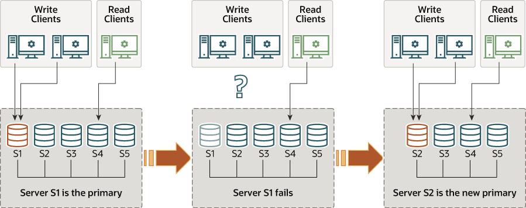
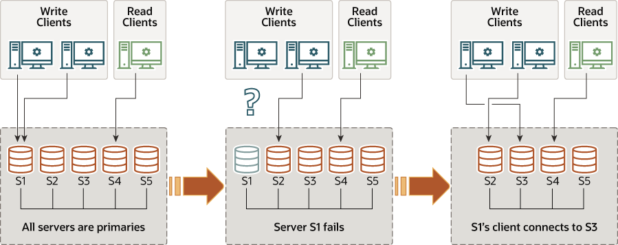

# 1. MGR简介 | 深入浅出MGR

[toc]

## 1. 为什么是MGR
MGR是MySQL Group Replication的缩写，即MySQL组复制。

在以往，我们一般是利用MySQL的主从复制或半同步复制来提供高可用解决方案，但这存在以下几个比较严重的问题：
1. 主从复制间容易发生复制延迟，尤其是在5.6以前的版本，以及当数据库实例中存在没有显式主键表时，很容易发生。
2. 主从复制节点间的数据一致性无法自行实现最终一致性。
3. 当主节点发生故障时，如果有多个从节点，无法自动从中选择合适的节点作为新的主节点。
4. 如果采用（增强）半同步复制，那么当有个从节点因为负载较高、网络延迟或其他意外因素使得事务无法及时确认时，也会反过来影响主节点的事务提交。

因为上述几个明显的缺点，因此MySQL推出了全新的高可用解决方案 -- 组复制，这是本系列文章要着重介绍的新特性。

MGR是MySQL 5.7.17开始引入的，但随着5.7版本逐渐退出历史舞台（MySQL 5.7已于2020年10月起不再做大的功能更新，只有修修补补以及针对安全更新），更多MGR相关特性都只在MySQL 8.0上才有。

因此，如果线上还有基于MySQL 5.7版本的MGR环境的话，建议尽快升级、迁移到MySQL 8.0版本。进一步提醒，推荐MySQL 8.0.22及之后的版本，整体会更稳定可靠，也有些很不错的新功能（不只是MGR方面的）。

## 2. MGR技术概要
MGR具备以下几个特点：
1. 基于shared-nothing模式，所有节点都有一份完整数据，发生故障时可以直接切换。
2. MGR提供了数据一致性保障，默认是**最终一致性**，可根据业务特征需要自行调整一致性级别。
3. 支持在线添加、删除节点，节点管理更方便。
4. 支持故障自动检测及自动切换，发生故障时能自动切换到新的主节点，再配合MySQL Router中间件，应用层无需干预或调整。
5. 支持单节点、多节点写入两种模式，可根据架构或业务需要选择哪种方案，不过**强烈建议选用单主模式**。

MGR可以选择单主（Single-Primary）模式

如上图所示，一开始S1节点是Primary角色，提供读写服务。当它发生故障时，剩下的S2-S5节点会再投票选举出S2作为新的Primary角色提供读写服务，而S1节点在达到一定超时阈值后，就会被踢出。

亦可选择多主（Multi-Primary）模式（再次**强烈建议选用单主模式**）

如上图所示，一开始S1-S5所有节点都是Primary角色，都可以提供读写服务，任何一个节点发生故障时，只需要把指向这个节点的流量切换下就行。

上述两种架构模式下，应用端通过MySQL Router连接后端在MGR服务，当后端节点发生切换时，Router会自动感知，对应用端来说几乎是透明的，影响很小，架构上也更灵活。

## 3. MGR技术架构
首先来个MGR的技术架构图：

MGR是以Plugin方式嵌入MySQL，部署更灵活方便。

事务从Server层通过钩子（hook）进入MGR API接口层，再分发到各组件层，在组件层完成事务Capture/Apply/Recover，通过复制协议层（Replication Protocol Logics）传输事务，最后经由GCS协调事务在各节点的最终一致性。

MGR节点间由组通信系统（GCS）提供支持，它提供了故障检测机制、组成员角色管理，以及安全且有序的消息传递，这些机制可确保在各节点间一致地复制数据。这项技术的核心是Paxos算法的实现，在MySQL里称之为XCom，由它充当MGR的通信引擎。

对于要提交的事务，组中的多数派节点必须就全局事务序列中给定的事务顺序达成一致。各节点做出决定提交或中止事务的选择，但所有节点都要做出相同的决定。如果发生网络分区，导致节点间无法达成一致决定，则在网络恢复前，MGR无法工作。

MGR支持单主和多主两种模式，在单主模式下，各节点会自动选定主节点，只有该主节点能同时读写，而其他（从）节点只能只读。在多主模式下，所有节点都可以进行读写。

相对于MariaDB Galera Cluster（以及基于此技术的Percona XtraDB Cluster，下面为了书写方便，都统称为PXC），个人认为MGR具备以下几个优势：
1. PXC的消息广播机制是在节点间循环的，需要所有节点都确认消息，因此只要有一个节点故障，则会导致整个PXC都发生故障。而MGR则是多数派投票模式，个别少数派节点故障时，一般不影响整体的可用性。这也是PXC存在的最大问题。
2. PXC的节点间数据传输除了binlog，还有个gcache，这相当于是给MySQL又增加两个黑盒子。而MGR则都是基于原生binlog的，没有新增黑盒子，运行起来更可靠，需要排障时也更方便。
3. 发生网络分区时，整个PXC集群都不可用。而MGR则至少还能提供只读服务。
4. PXC的流控机制影响更大，一旦触发流控，所有节点都受到影响。而MGR触发流控后，只会影响本地节点，不影响远程节点。当然了，MySQL的流控做的也比较粗糙，在GreatSQL中进一步完善和优化。
5. 执行DDL期间，整个PXC集群都不可同时执行DML，也就是说不支持Online DDL。而MGR是支持的，这也是很大的优势。

相对于传统主从复制（Replication），我认为MGR的优势有以下几点：
1. 主从复制非常容易产生复制延迟，尤其是当表中没有显式主键时。而在MGR里，要求表一定要有主键（或是可用作聚集索引的非空唯一索引），避免了这个问题。
2. 半同步复制中，一旦slave因为锁或其他原因响应慢的话，也会导致master事务被阻塞。MGR是采用多数派确认机制，个别节点响应慢对Primary节点的影响没那么大（不要选用AFTER模式）。
3. 主从复制没有类似MGR那样提供事务数据的一致性保证。MGR自带了事务数据一致性保障机制。

以上是我根据MySQL、MariaDB、Percona的资料整理得到的观点，不一定准确和全面，有不完善的地方还请留言指正。

## 4. 小结
本节主要介绍了什么是MGR，MGR的技术架构概要，以及MGR相对PXC的几个技术优势。

MGR是MySQL四部战略走的关键一环，依靠MGR和MySQL Shell、MySQL Router已实现了读节点扩展，以及写节点扩展（MGR多主模式），下一步预计实现sharding，让我们拭目以待。

相信MGR也是MySQL未来几年的重头戏，建议跟紧方向，不要错过这班列车。

## 参考资料、文档
- [MySQL 8.0 Reference Manual](https://dev.mysql.com/doc/refman/8.0/en/group-replication.html) 
- [数据库内核开发 - 温正湖](https://www.zhihu.com/column/c_206071340)
- [Group Replication原理 - 宋利兵](https://mp.weixin.qq.com/s/LFJtdpISVi45qv9Wksv19Q)

## 免责声明
因个人水平有限，专栏中难免存在错漏之处，请勿直接复制文档中的命令、方法直接应用于线上生产环境。请读者们务必先充分理解并在测试环境验证通过后方可正式实施，避免造成生产环境的破坏或损害。

## 加入团队
如果您有兴趣一起加入协作，欢迎联系我们，可直接提交PR，或者将内容以markdown的格式发送到邮箱：greatsql@greatdb.com。

亦可通过微信、QQ联系我们。

