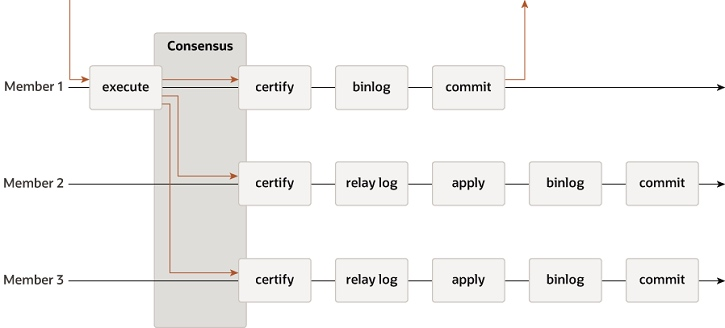

# 2. 组复制技术架构 | 深入浅出MGR

## 1. 传统主从复制技术架构
传统主从复制的方式是在master节点上执行数据更新事务，而后记录这些事务到binlog中，再将binlog发送到slave节点转储成relay log，在slave节点上再有单独的线程读取这些relay log然后重新执行或应用这些事务，它是shared-nothing的，每个节点都有一份完整的数据副本，其技术流程图如下所示：

MySQL还提供了半同步复制，这是在传统主从复制的基础上增加了一个同步的步骤，master节点上提交事务前，要先等到slave节点确认收到事务信息才可以（所以前文才说当slave节点响应慢时会影响master节点的事务提交），其技术流程图如下所示：

## 2. MGR组复制技术架构
MGR也是shared-nothing的，每个节点都有一份完整的数据副本，节点间通过GCS（Group Communication System）进行交互。GCS层提供了节点间的全局消息及其有序性的保证。

MGR可以做到在任何节点、任何时间都能执行读写事务（不含只读事务），不过读写事务要被整个复制组确认后才能提交。如果是只读事务则没有这个限制，任何节点都可以发起及提交。

当读写事务准备提交前，它会向复制组发出一个原子广播，内容包括：该事务修改的数据，及其所对应的writeset。复制组中所有节点要么接收该事务，要么都不接收。如果组中所有节点都接收该事务消息，那么它们都会按照与之前发送事务的相同顺序收到该广播消息。因此，所有组成员都以相同的顺序接收事务的写集，并为事务建立全局顺序。

在多个节点上并行执行的事务是可能产生冲突的，这时候就需要对比判断两个并行事务的writeset来确认，这个过程称为**事务认证**，也叫做**冲突检测**。事务冲突检测是行级别的，也就是说两个并行的事务更新同一行时，则视为产生冲突。这时的做法是全局顺序在前面的事务可以成功，所有节点都提交该事务。而全局顺序在后面的事务会失败回滚，各节点会删除该事务。这实际上是个分布式的谁先提交谁先赢得事务的规则。**建议**：如果经常发生节点间的事务冲突，那最好将这些事务放在同一个节点上执行，这样它们在本地事务并发控制协调下可能都可以提交成功，而不至于由于MGR的冲突检测而导致某个事务总是被回滚。

对于正在应用或外化的事务，MGR允许它们不一定按照原有顺序执行，只要不破坏事务的一致性和有效性即可。MGR默认要求是最终一致性，也就是说当所有事务都应用完毕后，所有节点的数据是一致的。当流量巨大时，事务可能会被外化而导致顺序轻微不一致。例如在多主模式下，一个本地事务在通过认证后会被立即外化，尽管此时可能还有个有这更早全局顺序的远程事务还没被应用，只要MGR的认证线程认为这个事务不会产生冲突即可。在单主模式下，在Primary节点上的本地并发事务，在不产生冲突的情况下，其提交和外化的顺序可能和该事物的全局事务顺序有轻微不一致。在Secondary节点上，由于没有写事务，因此它们的事务顺序和全局事务顺序是一致的。

下图描述了MGR的组复制协议，可以看到和传统主从复制（及半同步复制）的一些差异。为了简单起见，图中少了共识算法和Paxos相关的信息：

## 3. MGR的单主和多主模式
MGR支持单主或多主两种模式。

在启动时，通过设置选项 `group_replication_single_primary_mode` 来决定使用哪种模式，各节点中该值的设置要求一致。设置为 **ON** 时表示采用 **单主模式**，当设置为 **OFF** 时表示采用 **多主模式**。

在运行过程中，不能在线修改 `group_replication_single_primary_mode` 的值，但是从MySQL 8.0.13开始，可以通过调用 `group_replication_switch_to_single_primary_mode()` 和 `group_replication_switch_to_multi_primary_mode()` 这两个udf在线修改运行模式，或者通过MySQL Shell修改。

在 **单主模式** 下，有且只有一个（Primary）节点可以写入数据，其余（Secondary）节点都只能读数据。而在 **多主模式** 下，可以在任意节点上同时读写数据。

MGR最多只能支持9个节点，无论单主还是多主模式。

## 4. 节点管理
MGR由一组节点构成，每个节点都有唯一的名字，以 UUID 的格式表现。节点可以动态加入或离开（也可能是被动被驱逐）MGR。

MGR的组成员服务用于维护定义各活跃节点的信息，这些活跃节点信息也称之为**组视图（view）**。各节点的组视图是一致的，这表示在给定时刻组中有哪些活跃成员。

MGR各节点除了在事务提交时要保持一致外，也包括组视图发生变化时也要达成一致。当有新节点加入，或现有节点离开时，都会触发新的组视图变更。

当有节点主动离开集群时，它会触发集群自动重配置，剩下的节点会就新的组视图达成一致。但若节点是因为网络异常或宕机等原因意外离开集群时，则无法触发自动重配置，这时候集群故障检测机制会在该节点离开一段时间后识别到这个状态，并发出重配置组视图的提议。重配置组视图需要得到多数派成员的同意才行，当无法形成一致时，就无法实现自动重配置，需要人工介入处理。无法形成一致意见可能的原因有，剩下的节点数没达到总结点数的一半以上，也就是无法形成多数派。

在节点被确认故障之前，或在重新配置组以删除该故障节点前，允许该节点短暂离线，然后尝试重新加入集群。在这种情况下，该节点可能会丢失它以前的状态（事务数据），如果此时其他节点向它发送了包含崩溃前的消息，则这就可能会导致数据不一致等问题。

为了解决这个问题，从MySQL 5.7.22开始，MGR会检查具有相同地址+端口的节点再次以新身份加入集群的情况，确认当前是否还有其旧身份存在。这时候其新身份不能加入，直到旧身份能从集群中删掉。**注意：**，选项 `group_replication_member_expel_timeout` 的作用是设置一个等待期，使得节点在被正式驱逐前有更多时间尝试重新加回集群，也就是说处于被怀疑状态的节点，在超时之前还可尝试重新加入集群，再次作为活跃节点。当节点超过 `group_replication_member_expel_timeout` 阈值并被从集群中驱逐时，或节点执行 `STOP GROUP_REPLICATION` 退出集群，或因节点宕机等情况下，该节点必须以新身份重新加入集群。

## 5. 故障检测
MGR自带故障检测机制，它能发现并报告哪个节点处于静默状态，达到一定条件后会认为这个节点已死。它是个分布式的故障检测服务，提供了哪个节点处于（被怀疑）已死状态的信息。

当一个节点静默（不主动发信息，也不回复其他节点的信息）时，可能会触发被怀疑。当节点A在给定时间内还没有收到节点B的消息时，则发生消息超时并引发怀疑。在这之后，集群内其他成员如果一致同意（多数派达成一致）对该节点的怀疑是确定的话，则会判定该节点发生了故障。

如果某个节点因为网络故障和其他节点断开连接了，那么它可能也会怀疑其他节点发生了故障。但由于它不能形成多数派决议，因此这个怀疑是无效的，此时该节点无法执行任何读写事务，最多只能执行只读事务。

当网络不稳定时，随意两个节点间可能频繁断开和重连，理论上说可能会导致所有节点都会标记为驱逐，集群会退出并需要重建。为了避免这种情况，从MySQL 8.0.20开始，GCS会跟踪标记为驱逐的节点，并决定某个可疑节点是否还留在多数派节点中，这使得集群中至少有一个节点而不会退出。当被驱逐节点正式被从集群中移出时，GCS会删掉起被标记为驱逐的记录，使得它后面还能重新加回。

## 6.容错机制
MGR是基于分布式的Paxos算法实现，因此要求有多数派节点存活以保证投票。这就决定了在不影响系统整体可用性前提下，可容忍发生故障的节点数量。假设总节点数是n，可容忍发生故障的节点数是f，则它们的关系是：n = 2*f + 1。简言之，容忍发生故障的节点数，不高于总节点数的一半。

下表展示了不同节点数的对应关系：
| 总节点数 | 多数派节点数| 最大容忍故障节点数|
| --- | --- | --- |
|1 | 1 | 0 |
|2	|2	|0|
|3	|2	|1|
|4	|3	|1|
|5	|3	|2|
|6	|4	|2|
|7	|4	|3|
|8	|5	|3|
|9	|5	|4|

## 参考资料、文档
- [MySQL 8.0 Reference Manual](https://dev.mysql.com/doc/refman/8.0/en/group-replication.html) 
- [数据库内核开发 - 温正湖](https://www.zhihu.com/column/c_206071340)
- [Group Replication原理 - 宋利兵](https://mp.weixin.qq.com/s/LFJtdpISVi45qv9Wksv19Q)

## 免责声明
因个人水平有限，专栏中难免存在错漏之处，请勿直接复制文档中的命令、方法直接应用于线上生产环境。请读者们务必先充分理解并在测试环境验证通过后方可正式实施，避免造成生产环境的破坏或损害。

## 加入团队
如果您有兴趣一起加入协作，欢迎联系我们，可直接提交PR，或者将内容以markdown的格式发送到邮箱：greatsql@greatdb.com。

亦可通过微信、QQ联系我们。

