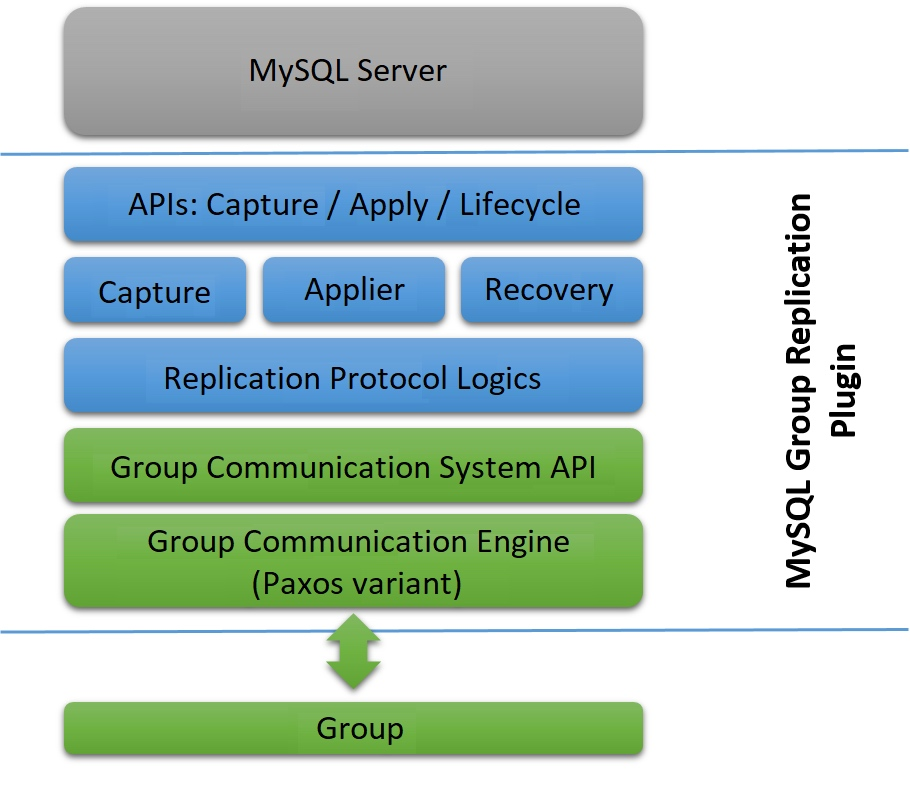
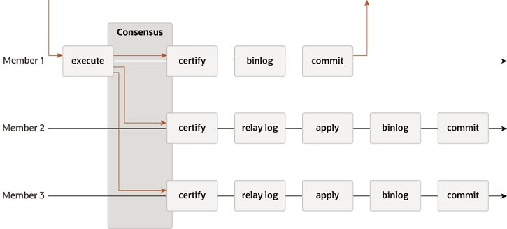

# 11. MGR技术架构及数据同步、认证机制 | 深入浅出MGR

本文简单介绍下MGR的整体技术架构概况，事务同步过程，事务认证机制等关键知识点。

## 1. MGR架构
再来看一遍MGR的架构图： 

从上图可知，MGR工作时，主要涉及到以下三层：
1. **Server层**：负责处理用户请求，接收用户事务，返回结果等。
2. **MGR处理层**：接收来自Server层的事务请求，处理Paxos层返回消息。
3. **Paxos层**：将所有消息进行全局排队，然后发送给MGR处理层。

MGR是以Plugin（插件）的方式集成到MySQL中，可以简单灵活部署，它在MySQL进行事务处理、Binlog传输和持久化等逻辑处理时，预埋了一些（Hook）钩子，在钩子上注册函数处理MGR相关逻辑。

以用户提交事务为例：
1. 用户线程发出commit，请求提交事务，处在Server层。
2. Server层调用MGR处理层，将事务信息通过Paxos层进行同步，用户线程等待。
3. MGR处理层处理Paxos同步后的消息，唤醒用户线程，返回到Server层。

在上面的架构图中，可以看到有以下几个模块：
1. **Capture**，负责跟踪本节点的事务。
2. **Applier**，负责执行远程事务（在其他节点产生的事务）。
3. **Recovery**，负责故障恢复时，选择donor节点，catch up binlog等。
4. **Replication Protocol Logics**，消息封装、接收XCom返回的消息、发送本节点消息给XCom、事务认证（冲突检测）等。
5. **GCE**，在GCS层具体实现XCom（XCom是eXtended COMmunications的缩写，是Paxos协议在MySQL里的具体实现，在有些文章中看到Paxos和XCom可以认为是同一个意思）。

MGR集群由DB1、DB2、DB3三个节点构成，则对于DB1来说，DB2、DB3上产生的事务就是远程事务，而DB1上产生的事务则是本地事务。

## 2. 事务数据同步、认证过程
用户发起事务请求，在MGR层的简化流程是下面这样的：
1. 事务写binlog前先进入到MGR层。
3. 将事务封装后通过Paxos一致性协议进行全局排序，发送给MGR各个节点。
4. 在各节点上进行认证该事务。
5. 认证通过后本地节点写Binlog完成提交，认证失败则回滚事务。
6. 其他远程节点上把该事务写relay log，后续再并行回放。

P.S，事务认证过程也叫做冲突检测，是同一个意思。

下图展示了事务在MGR的流转过程： 

下面介绍MGR工作流程中的一些关键点。

### 2.1 事务处理合法性判断
首先，需要先判断该事务是否需要交由MGR处理以及MGR当前是否可以处理事务。

如果事务已经属于group_replication_applier 或 group_replication_recovery channel，说明该事务已经被本节点或其他节点的MGR模块处理过，无需再进入MGR层。

如果事务进入MGR层，就先初始化事务GTID信息，这里要分为两种情况。通常，进入MGR的新事务还未产生GTID，表明该事务是在本节点第一次执行；另一种是已经有GTID，这说明该事务是通过主从复制通道进入MGR的，比如该节点同时是一个主从复制的Slave节点。对于第一种情况，会在完成事务认证（冲突检测）后分配GTID。

### 2.2 事务消息中都包含哪些信息
将待认证事务封装到消息中，主要包含以下几个信息：
1. 事务节点的server_uuid。
2. 事务执行时节点的gtid_executed和事务快照版本号。
3. 执行事务的thread_id。
4. 事务gtid是否已经分配。
5. 事务修改的记录集的主键列表writeset。

### 2.3 事务认证流程几个关键点
事务在每个节点上都需要进行认证，不管是本地事务还是远程事务。

事务在MGR中进行认证前，会先进行全局排序，形成共识（consensus）。事务全局排序时是基于round robin的方式分配到对应的消息轮次，所以即便是不同节点同时修改同一条记录的事务，经过全局排序后，也就有了先后顺序。

事务认证有几个要点：
1. 不同节点同时更新同一行数据（根据主键判定）才有可能产生冲突。
2. 不同节点同时更新不同数据行时，不会产生冲突。
3. 目前还不支持DDL的冲突检测。
4. 不同节点同时更新同一行（主键值相同）产生的事务，进行全局排序后，会得到不同的序号。

事务认证不是简单的对比，会先判断是否为本地事务（本节点产生的事务），事务是否已分配了gtid等多种情形分别进行不同的处理。
1. 将事务消息中的server_uuid和本地节点的server_uuid对比，以确定是否为本地事务。
2. 将事务消息中的gtid_executed和本地认证数据库对比，判断是否合法事务。
3. 从本地认证数据库中获取待认证事务更新的每个主键的版本信息，与待认证事务的快照版本进行一一比对，只有待认证事务的快照版本不是本地认证数据库中对应主键版本的子集时，事务才能够判定为认证通过。

### 2.4 事务认证数据库清理
再来看下事务认证数据库里的数据什么时候可以被清理，怎么清理的，以及MGR里经典的60s性能抖动问题。

- **什么时候可以被清理**，认证通过且已被各个节点都提交的事务可以被清理。先获取集群中各个节点的gtid_executed信息并取交集，再将数据库中每条主键记录的版本跟该交集进行对比，若主键版本是该交集的子集，那么后续事务的认证一定用不到该主键版本信息，可以被安全清理掉。
- **如何清理**，MGR的每个节点维护一个后台线程，该线程每隔60s（硬编码，目前无法调整）清理事务，所以当待清理事务特别多的时候，可能会出现性能抖动问题（这个问题在GreatSQL中解决了，不复存在）。

从上述的清理机制可见，使用MGR时应该注意几点：
- 多使用小事务，避免事务堵塞。当事务中包含大量记录时，每60s的定时任务可能无法清理完毕，造成性能抖动。
- 流控机制是以事务为单位进行统计和限速的，有大事务时显然不合理（GreatSQL中优化了流控算法，除了事务数，还考虑事务大小，以及主从节点的延迟情况，更为有效）。
- 不要在业务高峰期执行DDL。因为大表DDL时，也可能引发事务认证数据库暴涨的问题。因为Online DDL期间DML的事务无法被清理，可能会把内存爆掉。

## 3. 多数派原则
不同于PXC要求所有节点都必须达成一致，MGR采用多数派原则。也就是说，在一个MGR集群里，只要达成多数派一致（存活节点数超过一半），事务还是可以正常写入的。此外，MGR最高可支持9个节点，因此不同节点数和最多可容忍故障节点数的关系如下表所示：
| 总节点数 | 多数派节点数| 最大容忍故障节点数|
| --- | --- | --- |
|1      |1      |0|
|2	|2	|0|
|3	|2	|1|
|4	|3	|1|
|5	|3	|2|
|6	|4	|2|
|7	|4	|3|
|8	|5	|3|
|9	|5	|4|

上表是指 **最大同时故障节点数** 。例如，9个节点的MGR中，最多可容忍同时4个节点发生故障。

在另一种情况下，如果各节点是 **逐个陆续发生故障的话，每发生一个节点故障，MGR就会逐次降级** ，从9个节点降级为8个节点，最终降级为3个节点，此时最多还能容错1个节点发生故障。在这种情况下，原来9个节点的MGR，最多可容忍7个节点发生故障。当然了，这种情况比较极端，并不常见。

## 4. 启用MGR的一些先决条件
想要启用MGR，需要先满足几个先决条件：
01. 每个节点都必须启用binlog，而且使用row格式。
02. 每个节点都要启用binlog转储，即 `log_slave_updates=1` 或 `log_replica_updates=1`。
03. 每个节点的 `server_id` 及 `server_uuid` 不能相同。
04. 在8.0.20之前，要求 `binlog_checksum=NONE`，但是从8.0.20后，可以设置 `binlog_checksum=CRC32`。
05. 要求启用 GTID，即设置 `gtid_mode=ON` 及 `enforce_gtid_consistency=ON`。
06. 要求 `master_info_repository=TABLE` 及 `relay_log_info_repository=TABLE`，不过从MySQL 8.0.23开始，这两个选项已经默认设置TABLE，因此无需再单独设置。
07. 所有节点上的表名大小写参数 `lower_case_table_names` 设置要求一致。
08. 只支持InnoDB表，其余表虽然也能创建，但无法同步数据（Primary节点上写入数据时会报错）。
09. 必须要有主键，如果没有主键（或者可以被选中作为聚集索引的辅助索引），则写入数据时会报错。
10. 建议启用writeset模式，即设置以下几个参数
    - `slave_parallel_type = LOGICAL_CLOCK`
    - `slave_parallel_workers = N`，N>0，可以设置为逻辑CPU数的2倍
    - `binlog_transaction_dependency_tracking = WRITESET`
    - `slave_preserve_commit_order = 1`
    - `slave_checkpoint_period = 2`

## 5. 小结
本文介绍了MGR的整体技术架构概况，事务同步过程，事务认证机制等内容，使用MGR时需要注意的一些约束条件以及关键点。

## 参考资料、文档
- [MySQL 8.0 Reference Manual](https://dev.mysql.com/doc/refman/8.0/en/group-replication.html) 
- [数据库内核开发 - 温正湖](https://www.zhihu.com/column/c_206071340)
- [Group Replication原理 - 宋利兵](https://mp.weixin.qq.com/s/LFJtdpISVi45qv9Wksv19Q)

## 免责声明
因个人水平有限，专栏中难免存在错漏之处，请勿直接复制文档中的命令、方法直接应用于线上生产环境。请读者们务必先充分理解并在测试环境验证通过后方可正式实施，避免造成生产环境的破坏或损害。

## 加入团队
如果您有兴趣一起加入协作，欢迎联系我们，可直接提交PR，或者将内容以markdown的格式发送到邮箱：greatsql@greatdb.com。

亦可通过微信、QQ联系我们。

