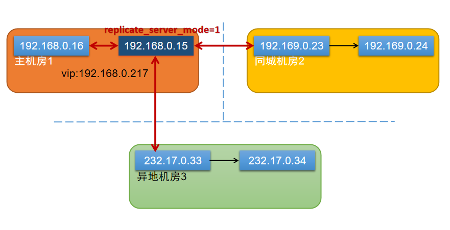

# 基于GreatSQL的跨机房多通道主主复制容灾切换实战演练
---

## 1. 多通道主主复制简述
社会数字化转型过程中IT系统容灾能力将影响社会运行稳定。2023年工信部等六部门联合印发《算力基础设施高质量发展行动计划》，要求到2025年，重点行业核心数据、重要数据灾备覆盖率达到100%。

容灾架构需要定期进行演练，才能确保方案的有效性。企业数字化转型过程中拥有海量数据库实例，传统的MySQL数据库容灾方案搭建易、演练难。通过多通道主主复制技术，实现大规模数据库实例下简单低成本的容灾体系的建设，既负责建设，也负责日常的维护，充分保障数据安全性和关键业务的连续性。

## 2.多通道主主复制部署
### 2.1部署架构图



传统的模式开启多源复制和主主复制会出现数据复制回路的问题。在GreatSQL 8.0.32-25中新增 `replicate_server_mode` 选项，当主机房边界节点配置该值为1时，该主节点的每个主从复制通道仅复制临近主节点的binlog日志，丢弃级联上层主节点或者其他数据库实例产生的binlog，能够解决数据回路问题。


### 2.2数据库节点信息

**1、主机房1**

- 数据库A节点：192.168.0.15

- 数据库B节点：192.168.0.16

- VIP：192.168.0.217

- `replicate_server_mode` 默认值为0。主机房边界节点 192.168.0.15 的my.cnf配置 `replicate_server_mode = 1`，主从复制链路仅应用临近主库产生binlog，其他节点保持默认值0。

**2、同城机房2**

- 同城容灾数据库节点C：192.169.0.23

- 同城容灾数据库从库节点D：192.169.0.24

**3、异地机房3**

- 异地容灾数据库节点E：232.17.0.33

- 异地容灾数据库从库节点F：232.17.0.34

### 2.3 机房内建立主从

同一个机房内的两个数据库实例间建立主从复制关系，同时修改my.cnf配置，错开各个实例的自增长ID值间隔，降低多写冲突风险。`replicate_server_mode` 默认值为0，除了主机房边界节点192.168.0.15修改`replicate_server_mode = 1` 外，其他节点都保持默认值0。

- 主机房1数据库节点A：192.168.0.15
```
auto_increment_offset = 1
replicate_server_mode=1
```

- 主机房1数据库节点B：192.168.0.16
```
auto_increment_offset = 2
```

- 同城机房2容灾数据库节点C：192.169.0.23
```
auto_increment_offset = 3
```

- 同城机房2容灾数据库从库节点D：192.169.0.24
```
auto_increment_offset = 4
```

- 异地机房3容灾数据库节点E：232.17.0.33
```
auto_increment_offset = 5
```

- 异地机房3容灾数据库从库节点F：232.17.0.34
```
auto_increment_offset = 1
```

上面只展示几个主要选项配置，其他更多选项配置这里不赘述。

### 2.4建立多通道主主

主机房边界节点和其他节点建立多源复制。

- 验证主机房边界节点是否开启多通道主主复制：

```sql
mysql> show variables like 'replicate_server_mode';
+-----------------------+-------+
| Variable_name         | Value |
+-----------------------+-------+
| replicate_server_mode | ON    |
+-----------------------+-------+
```

- 与主机房备库节点建立主从复制：
```sql
change master to master_host='192.168.0.16',master_user='repl',master_password='xxxxxx',MASTER_LOG_FILE='mysql-bin.000003',MASTER_LOG_POS=4 for channel 'dr_center1_s0_16'; 
start slave for channel 'dr_center1_s0_16'; 
```

- 与同城机房2主库节点建立主从复制：
```sql
change master to master_host='192.169.0.23',master_user='repl',master_password='xxxxxx',MASTER_LOG_FILE='mysql-bin.000003',MASTER_LOG_POS=254 for channel 'dr_center2_s0_23'; 
start slave for channel 'dr_center2_s0_23';
```

- 与异地机房3主库节点建立主从复制：
```sql
change master to master_host='232.17.0.33',master_user='repl',master_password='xxxxxx',MASTER_LOG_FILE='mysql-bin.000004',MASTER_LOG_POS=4 for channel 'dr_center3_s0_33'; 
start slave for channel 'dr_center3_s0_33';
```

## 3.容灾演练部署

### 3.1主机房高可用演练

以keepalived高可用方案为例：

- 在主机房边界节点主库数据库A节点（192.168.0.15）：

执行 `ip a` 查看VIP是否在主库上。
```
$ ip a
...
1: eth0: <BROADCAST,MULTICAST,UP,LOWER_UP> mtu 1500 qdisc mq state UP qlen 1000
    link/ether fa:16:3e:72:e7:87 brd ff:ff:ff:ff:ff:ff
    inet 192.168.0.15/24 brd 192.168.0.255 scope global eth0
       valid_lft forever preferred_lft forever
    inet 192.168.0.217/24 scope global secondary eth0
       valid_lft forever preferred_lft forever
    inet6 34ef::f816:3eff:fe72:c787/64 scope link 
       valid_lft forever preferred_lft forever
...
```
确认后停掉keepavlied，确认VIP漂移到备库。

```
$ service keepalived stop
```
查看VIP已经下线。

```
$ ip a
...
1: eth0: <BROADCAST,MULTICAST,UP,LOWER_UP> mtu 1500 qdisc mq state UP qlen 1000
    link/ether fa:16:3e:72:e7:87 brd ff:ff:ff:ff:ff:ff
    inet 192.168.0.15/24 brd 192.168.0.255 scope global eth0
       valid_lft forever preferred_lft forever
    inet6 34ef::f816:3eff:fe72:c787/64 scope link 
       valid_lft forever preferred_lft forever
...
```

- 主机房数据库B节点（192.168.0.16）：

执行 `ip a` 查看VIP是否绑定。

```
$ ip a
...
1: eth0: <BROADCAST,MULTICAST,UP,LOWER_UP> mtu 1500 qdisc mq state UP qlen 1000
    link/ether fa:78:3e:72:e7:87 brd ff:ff:ff:ff:ff:ff
    inet 192.168.0.16/24 brd 192.168.0.255 scope global eth0
       valid_lft forever preferred_lft forever
    inet 192.168.0.217/24 scope global secondary eth0
       valid_lft forever preferred_lft forever
    inet6 fe80::4568:3eff:fe72:c787/64 scope link 
       valid_lft forever preferred_lft forever
...
```

### 3.2机房间容灾演练
以业务访问数据库通过内部域名DNS系统为例，修改域名指向的ip来实现机房切换。

1、同城容灾数据库C（192.169.0.23）上执行 `SHOW SLAVE STATUS` 查看主从状态，如果复制延迟太大则不建议执行容灾切换操作。

2、设置主机房数据库A（192.168.0.15）上执行 `SET GLOBAL READ_ONLY=1` 设置只读模式。

3、通常建议至少等待N秒，降低潜在大事务和主从延迟风险，或者增加相应的延迟与否判断机制。

4、同城容灾数据库C（192.169.0.23）上执行 `SET GLOBAL READ_ONLY=0` 设置可写模式。

5、修改DNS域名指向地址，由主机房VIP 192.168.0.217更改为同城容灾节点IP 192.169.0.23，并主动刷新DNS缓存。

6、在主机房数据库A（192.168.0.15）上断开当前活跃连接。

7、等待10s，第二次执行第5步

## 4.总结

上述跨机房多通道主主复制容灾方案中融合了多源复制和主主复制两种复制策略，它能够支持数据库主节点和同机房内的数据库节点、同城第二机房内的数据库节点、以及异地机房内的数据库节点等多个数据库从节点分别建立主主复制关系，确保演练过程产生的增量数据能够自动应用到其他节点，无需更改主从配置，降低了容灾演练出错的风险，方便容灾自动化平台的快速集成。

在上述高可用容灾方案中，利用新增的 `replicate_server_mode` 选项，只需对主机房边界节点进行升级，不需要像GTID模式那样修改全局配置，级联模式重度运维困难，易误操作导致数据不一致。

本方案的演练回切由传统的1小时减低到5分钟以内，极大提升了演练效率。同一时刻只有一个库可写，其他备选主库只读模式，避免多写导致数据冲突的风险。


