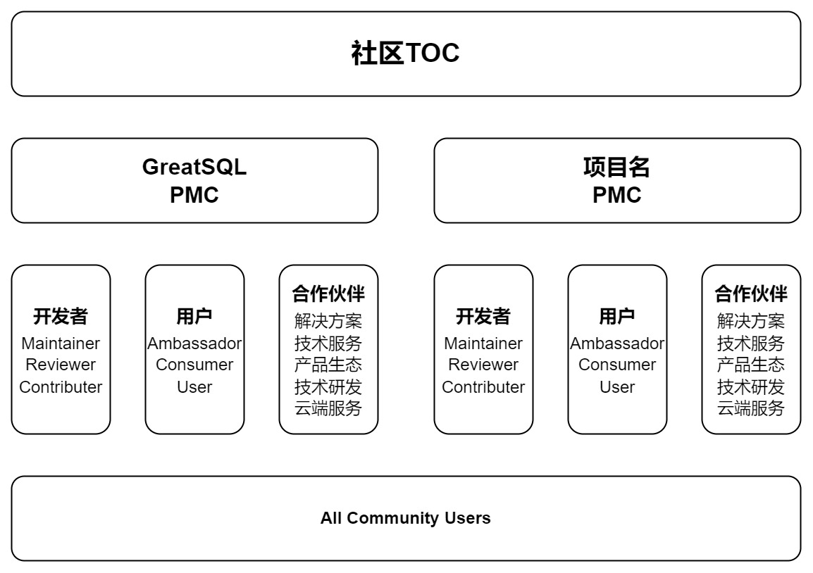

社区技术观察委员会（TOC）
项目管理委员会（PMC）
- 开发者端：Maintainer、Reviewer、Contributor
- 用户端：Ambassador、Consumer、User
- 合作伙伴：解决方案、技术服务、产业生态、技术研发、云端服务

# 社区技术观察委员会 TOC
开源社区技术观察委员会（Technical Observe Committee，简称 TOC）是社区各项目的技术管理机构，对所有项目进行统筹规划管理，提供技术指导、决策和监督。

**职责与权力**

 技术观察委员会是社区的技术领导机构，其主要职权是：
 - 拥有社区下各项目技术决策的最终裁决权。
 - 指导决策社区下各项目技术的发展愿景和方向。
 - 引导社区技术创新，保证社区具有持续的技术竞争力。
 - 引导社区建立原创性开源项目，持续构建社区技术影响力。

 另设主席 1 名，主席的职权是：
 - 召集和主持技术观察委员会会议，并保证参会人员有充分表达技术意见的权利。
 - 在各类会议、活动中代表社区进行宣传。
 - 主席同时是技术观察委员会委员，拥有和其他委员相同的投票权利。

**成员**
 - 开源社区 TOC 主席及成员，由社区任命，包含对社区做出重大贡献并愿意持续投入的人员。
 - 为保障技术观察委员会的运作，经过 TOC 例会决策，可强制离任连续 2 次不参加 TOC 会议的委员；TOC 成员因个人原因申请离任的，应通知全体 TOC 成员。

**会议召开与决策机制**
 - 技术观察委员会每两周召开技术委员会例会，或 1/2 以上委员提议召开临时会议。
 - 技术委员会会议由主席在会议召开前 5 个自然日通过邮件在邮件列表通知全体委员，会议通知应当包括召开的地点、日期、时间、方式和会议议题以及可用的参考来源，以便委员对会议内容获取相关信息进行准备。会议为公开会议，任何社区成员都可以参加会议，表达技术观点但无投票权利。
 - 技术委员会会议须有 2/3 以上（含）的委员出席为有效会议。
 - 所有决议均需要在有效的例会进行投票表决，投票为公开记名投票。投票分为赞同票、反对票和弃权票，只有 2/3 以上（含）的与会委员且超过全体委员会的 1/2 投赞同票，决议才能通过，未到场委员不能委托其他人代替投票。

# 项目管理委员会 PMC
项目管理委员会，是社区下单一项目的管理机构。保证项目技术高质量，维持正常的开发迭代，并对项目运营提供各类支持工作。

**职责与权力**
 - 落实项目日常开发工作，保证项目发行版高质量发布。
 - 对项目的开发迭代和社区活动的运转提供重要支持。项目咨询支持。
 - 指导项目的开源布道和未来发展方向。
 - 组织项目讨论，对项目重大决策给予建议。
 - 决策项目 SIG 的成立、撤销、合并等事务。解决 SIG 组之间的协作冲突，辅导、审视和监督 SIG 组的日常运作。
 另设主席 1 名，主席的职权是：
 - 召集和主持项目管理委员会会议，并保证参会人员有充分表达技术意见的权利。
 - 在各类会议、活动中代表项目进行宣传。
 - 主席同时是项目管理委员会委员，拥有和其他委员相同的投票权利。

**成员**
 - PMC 主席，由 TOC 提名，并在 TOC内 部进行票选，得票超过 TOC 在任委员数量的 1/2，即通过。
 - PMC 初始成员，将由 TOC 直接任命。PMC 主席亦可提名初始成员，并由 TOC 进行票选。
 - PMC 成立后，PMC 主席可提名项目人员加入 PMC，并由 PMC 在任委员进行票选。
 - 对项目做出重大贡献并愿意持续投入的 Maintainer、Ambassador 也可在 PMC 成立后申请加入，并由 PMC 进行票选。票数超过 PMC 在任委员数的 1/2，即可通过。

## 开发者端
### Maintainer
 从 Reviewer 中诞生，负责 GreatSQL 的规划和维护，拥有合并主分支的权限，对项目的表现有良好的判断力，参与和主导项目的更新，参加并进行 GreatSQL 相关的技术分享，参与撰写相关技术文章。

 **晋升标准**
 - 深度理解 GreatSQL 的原理，对 GreatSQL 的未来规划有清晰的理解；
 - 有能力及时处理项目出现的各种问题；
 - 主导项目的开发和迭代，把控项目整体优化方向；
 - 需为 Reviewer，且获得至少两个 Maintainer 提名；

 **职责**
 - 保证项目的代码质量，主导和把控项目的开发和迭代进度；
 - 参与 GreatSQL 的未来规划和技术设计，参加版本规划和 RFC 评审会议；
 - 参加社区活动（比如线上或线下 meetup 等社区活动），进一步了解相关知识，并在社区中与其他开发者交流，引导和帮助其他贡献者投入到项目的开发当中；

 **权益**
 - 经过获得授权同意以后，作为 Maintainer 展示在 GreatSQL 官网贡献者名单；
 - 在社区提供的平台或大型技术峰会上，分享 GreatSQL 相关技术见解，与社区成员共同获得进步和成长，提升个人影响力；
 - 获得 GreatSQL 社区 Maintainer 证书作为纪念；
 - 参与项目线上/线下活动的制定与组织工作；
 - 成为 Maintainer 后可申请领取社区周边定制纪念品U型枕+保温杯+双肩背包三件套 1 份及社区金币商城任意书籍 1 本；

### Reviewer
 从 Contributor 中诞生，参与 GreatSQL 的规划和维护，对项目的表现有良好的判断力，关注并参与项目的更新，参加 GreatSQL 相关的技术分享，参与撰写相关技术文章。

 **晋升标准**
 - 提交过至少 5 个重要 PR，并被合并到 GreatSQL 项目下的用户；或参与主导修复重大 bug，撰写和修订相关的文档；
 - 获得至少 2 个 Reviewer 或者 1 个 Maintainer 提名；
 - 有能力及时处理项目出现的各种问题，帮助其他人解决疑惑，回答 Issue 中的问题；
 - 关注未知错误，提出和帮助修复 bug；
 - 帮助规范和改进文档，测试项目；
 - 积极参与项目组织的线上/线下活动，参与讨论；

 **职责**
 - 关注和把控项目的代码质量，积极参与项目的开发和迭代；
 - 负责审查社区代码，对新提交的代码进行审批；
 - 参加社区活动（比如线上或线下 meetup 等社区活动），进一步了解相关知识，并在社区中与其他开发者交流，引导和帮助其他贡献者投入到项目的开发当中；

 **权益**
 - 经过获得授权同意以后，作为Reviewer展示在GreatSQL官网贡献者名单中；
 - 获得GreatSQL社区Reviewer证书作为纪念；
 - 参与项目线上/线下活动的组织工作；
 - 成为Reviewer后可申请领取社区周边定制纪念品雨伞+长袖卫衣两件套 1 份；

### Contributor
 为 GreatSQL 开源社区做出贡献就可以成为 Contributor，我们欢迎所有的贡献者，并会为所有希望对项目做出贡献的伙伴提供帮助。

 **晋升标准**
 - 提交过至少 1 个重要 PR，并被合并到 GreatSQL 项目下的用户。

 **职责**
 - 积极提出你的问题，参与 GreatSQL 的迭代和优化；
 - 参加社区活动（比如线上或线下 meetup 等社区活动），进一步了解相关知识，并在社区中与其他开发者交流；
 - 积极参与贡献者任务；
 
 **权益**
 - 作为 Contributor 展示在 GreatSQL 官网贡献者名单；
 - 成为 Contributor 后可申请领取社区周边定制纪念品短袖T恤 1 件；

## 用户端
### Ambassador
 **界定条件**
 - 在生产环境中部署了 GreatSQL 的企业用户；
 - 并愿意通过案例研究、博客、项目活动、项目会议等形式主动参与宣传 GreatSQL 使用体验的企业用户；

 **权益**
 - 可参与项目的未来规划和技术设计，参加版本规划及 RFC 评审会议；
 - 线上/线下活动的特殊受邀分享嘉宾，提升企业/个人影响力；
 - Consumer 中包含的所有权益；

### Consumer
 **界定条件**
 - 在生产环境中部署了 GreatSQL 的企业用户。

 **权益**
 - 免费获得开发团队的技术支持；
 - 可申请成为线上/线下活动的演讲分享嘉宾，提升企业/个人影响力；
 - 第一时间获得项目新版本的测试资格；
 - User 中包含的所有权益；

### User
 **界定条件**
 - 测试、使用 GreatSQL 产品的企业/个人用户。

 **权益**
 - 在项目网站获取官方最新产品文档；
 - 可参与项目官方组织的线上/线下 meetup、交流会；
 - 可在 Gitee 中通过提交 Issue 申请官方技术支持；
 - 可在官方论坛中通过与其它开发者、用户交流获取帮助；

## 合作伙伴
为了能更好的促进 GreatSQL 社区发展，同时也为了给 GreatSQL 社区用户更好的服务，社区在此诚挚的邀请广大企业伙伴，一起交流合作，共建开源社区！

成为社区合作伙伴，将享有以下权益：
- 官方背书：达成合作的企业，将在社区官网合作伙伴处进行宣传展示，提供官方认证资质
- 深度支持：社区将提供专业的产品技术支持，打造联合解决方案
- 联合推广：多种营销方式助力合作伙伴联合市场推广
- 活动宣讲：由社区主办的线上/线下交流会，合作伙伴将优先免费享有内容分享资格
- 深度赋能：社区提供多种培养计划和技术认证，为合作伙伴实现全方位赋能

### 解决方案合作伙伴
面向独立的软件开发商，帮助软件开发商基于 GreatSQL 产品制订并推广解决方案。
针对这样的合作伙伴，GreatSQL 社区将提供围绕解决方案的商业市场推广以及产品技术支持，协助合作伙伴推进其解决方案在行业客户场景内落地，共同服务行业客户，最终与合作伙伴达成深度持久的发展合作。

### 技术服务合作伙伴
面向第三方技术支持服务商，需具备 GreatSQL 产品服务交付能力，为客户提供系统集成、架构设计、数据库迁移、实施和运维管理等。
针对这样的合作伙伴，GreatSQL 社区将提供包括 GreatSQL 培训计划、GreatSQL 社区认证、开源社区支持等，来帮助社区的合作伙伴培养熟悉 GreatSQL  的专业人才，为客户提供有 GreatSQL 品质保证的技术服务能力。

### 产业生态合作伙伴
面向数据库产业生态上下游厂商，包括如操作系统、芯片、中间件、存储等。
针对这样的合作伙伴，GreatSQL 社区将会提供包括产品兼容性的测试以及相应的产品适配认证计划。

### 技术研发合作伙伴
面向具有一定研发实力的，可以基于自身对数据库、行业、运维和服务的理解，对 GreatSQL 进行定制化开发的技术厂商。比如：独立的存储引擎；异构平台的打通；运维相关经验的平台产品等。
针对这样的合作伙伴，GreatSQL 社区将会与您联合进行产品的开发以及后续的产品运营。

### 云端服务合作伙伴
面向可以提供自有云服务的云厂商，基于 GreatSQL，联合公有云、私有云、行业云的合作计划。
针对这样的合作伙伴，GreatSQL 社区将面向合作伙伴的企业云提供端口与接入测试，并协助合作伙伴进行 GreatSQL 适配优化调试，以确保在合作伙伴的云端依旧平稳运行，为云厂商的行业客户提供更多选择。

[def]: ../../community-toc.jpg