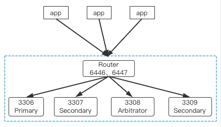

# 单机多实例高可用
---

本文档介绍如何在单机多实例环境下，构建GreatSQL数据库高可用架构方案。

注意，线上生产环境通常**不要采用单机多实例架构方案，本方案仅用于开发、测试环境**。

## 1. 高可用方案选择

单机多实例上的高可用方案比较简单，一般可以选用以下几种：

1. lvs/haproxy。
2. mysql router中间件。

本文重点讨论利用mysql router构建高可用的解决方案，lvs/haproxy方案请自行搜索。

## 2. 单机多实例部署MGR集群

首先，参考文档：[单机多实例](../5-oper-guide/5-6-multi-instances.md) 完成单机多实例环境部署，并构建MGR集群。
```
mysql> select MEMBER_ID,MEMBER_HOST,MEMBER_PORT,MEMBER_ROLE from performance_schema.replication_group_members;
+--------------------------------------+-------------+-------------+-------------+
| MEMBER_ID                            | MEMBER_HOST | MEMBER_PORT | MEMBER_ROLE |
+--------------------------------------+-------------+-------------+-------------+
| 62edd23f-07fa-11ed-aad1-00155d064000 | 127.0.0.1   |        3309 | SECONDARY   |
| 66c5a894-07e6-11ed-b1ff-00155d064000 | 127.0.0.1   |        3306 | PRIMARY     |
| 6e65ef68-07e6-11ed-a6d8-00155d064000 | 127.0.0.1   |        3307 | SECONDARY   |
| 6f367f17-07e6-11ed-825d-00155d064000 | 127.0.0.1   |        3308 | ARBITRATOR  |
+--------------------------------------+-------------+-------------+-------------+
```
这是一个单机4实例的MGR集群，其中包含1个ARBITRATOR节点。

## 3. 部署MySQL Router

在前文 [读写分离](../5-oper-guide/5-3-oper-rw-splitting.md) 中介绍过，MySQL Router最好是和应用程序端部署在一起。

MySQL Router的部署方法可以参考文档：[读写分离](../5-oper-guide/5-3-oper-rw-splitting.md)。

应用程序端只需连接到router的读写分离端口，而无需关注后端数据库实际拓扑结构，当Primary节点发生切换时，或者某个Secondary节点下线时，都不影响应用程序端的使用。

此时高可用架构图大致如下所示：



在本案中，因为是单机多实例环境，因此直接把MySQL Router和数据库服务器部署在一起，没有分开。

**问题反馈**
---
- [问题反馈 gitee](https://gitee.com/GreatSQL/GreatSQL-Doc/issues)


**联系我们**
---

扫码关注微信公众号


