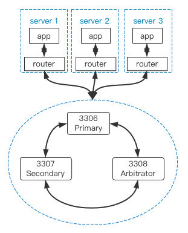

# 单IDC高可用
---

本文档主要介绍在单IDC场景中，如何基于GreatSQL+MySQL Router构建高可用架构。

## 1. 单IDC高可用方案选择

单IDC场景下的高可用方案也比较简单，一般可以选用以下几种：

1. lvs/haproxy。
2. mysql router中间件。

本文重点讨论利用mysql router构建高可用的解决方案，lvs/haproxy方案请自行搜索。

## 2. MySQL Router + GreatSQL MGR 实现单IDC内高可用

首先，构建一个三节点的MGR集群，该集群包含Primary、Secondary、Arbitrator三种节点。
```
mysql> select * from performance_schema.replication_group_members;
+---------------------------+--------------------------------------+--------------+-------------+--------------+-------------+----------------+
| CHANNEL_NAME              | MEMBER_ID                            | MEMBER_HOST  | MEMBER_PORT | MEMBER_STATE | MEMBER_ROLE | MEMBER_VERSION |
+---------------------------+--------------------------------------+--------------+-------------+--------------+-------------+----------------+
| group_replication_applier | af39db70-6850-11ec-94c9-00155d064000 | greatsql-01  |        3306 | ONLINE       | PRIMARY     | 8.0.25         |
| group_replication_applier | b05c0838-6850-11ec-a06b-00155d064000 | greatsql-02  |        3306 | ONLINE       | SECONDARY   | 8.0.25         |
| group_replication_applier | b0f86046-6850-11ec-92fe-00155d064000 | greatsql-03  |        3306 | ONLINE       | ARBITRATOR  | 8.0.25         |
+---------------------------+--------------------------------------+--------------+-------------+--------------+-------------+----------------+
```

还是老样子，把MySQL Router部署在应用服务器端而非数据库服务器端，这样就不需要针对MySQL Router部署高可用方案。

整体架构看起来像是这样：




**问题反馈**
---
- [问题反馈 gitee](https://gitee.com/GreatSQL/GreatSQL-Doc/issues)


**联系我们**
---

扫码关注微信公众号


