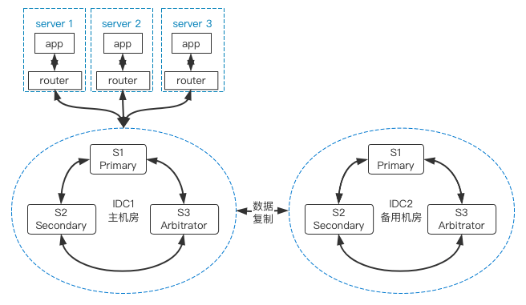
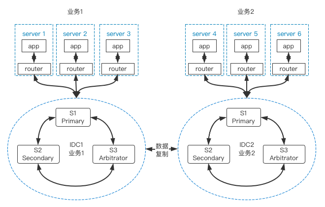
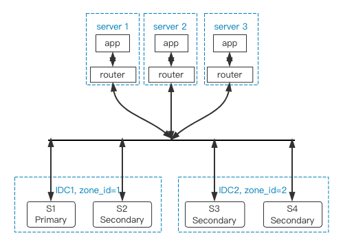

# 同城跨IDC高可用
---

本文档主要介绍在同城跨IDC场景中，如何基于GreatSQL+MySQL Router构建高可用架构。

同城多IDC的数据库架构，通常有以下几种方案可选：

## 主备架构方案

这里不是指MySQL的主从复制方案，而是指一个主IDC对业务提供服务，另一个IDC作为备用资源，在紧急情况下可以整体切换，并承担一部分只读业务。

## 垂直区分业务方案

两个IDC分别承担一部分业务，在架构设计层面，对业务做好垂直拆分，部分业务放在A机房，另一部分业务放在B机房，在两套数据库间建立数据复制通道，保证两边数据最终一致。当其中一个IDC发生故障时，只会影响一部分业务。在数据一致性有保障的前提下，还可以将故障IDC的业务切换到正常IDC中。

## 整体MGR方案

在两个IDC间构建一个跨IDC的MGR集群，这时候就要求两个IDC间的网络延迟不能太大，此时要求Primary节点所在本IDC有备用节点外，在另一个IDC也要保证能复制所有数据，这时可以利用GreatSQL的 **地理标签** 特性来保障。

**问题反馈**
---
- [问题反馈 gitee](https://gitee.com/GreatSQL/GreatSQL-Doc/issues)

**联系我们**
---

扫码关注微信公众号

