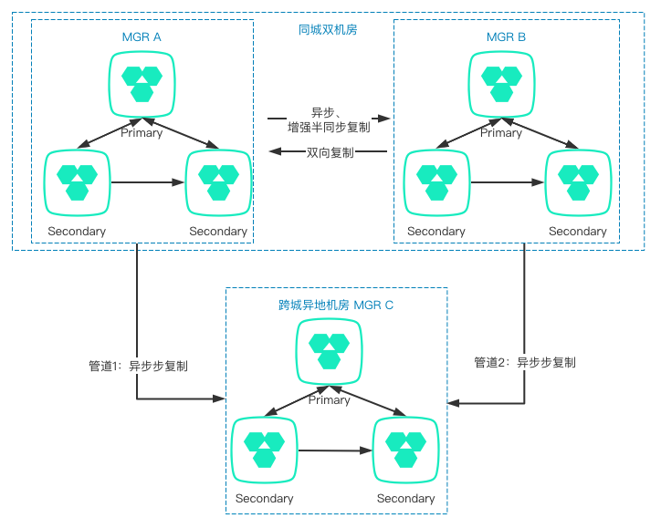

# 跨城多IDC高可用
---

本文档主要介绍在跨城多IDC场景中，如何基于GreatSQL+MySQL Router构建高可用架构。

跨城多IDC架构，基本上都是基于同城多IDC的数据库架构，再增加一个异地备用IDC，在本地城市所有机房都发生重大故障时，在异地机房有一套备用系统，用于紧急情况下临时地、有损地响应业务需求。

此外，备用IDC可以利用Async Replication Auto failover特性，使得再主节点发生切换时，它不需要有额外的运维操作。

整体架构图如下所示：

**问题反馈**
---
- [问题反馈 gitee](https://gitee.com/GreatSQL/GreatSQL-Doc/issues)

**联系我们**
---

扫码关注微信公众号

